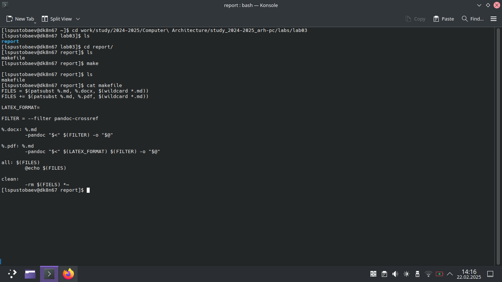
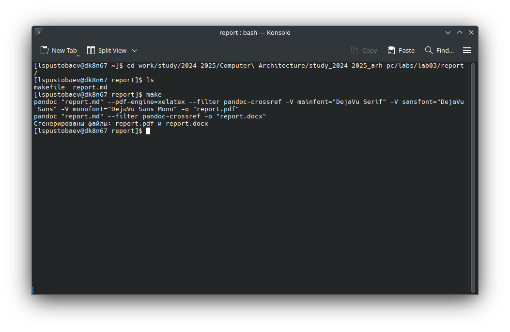

# Титульный лист

**Номер лабораторной работы:** 3  
**ФИО студента:** Пустобаев Леонид Сергеевич
**Группа:** НММбд03-2024

---

# Цель работы

Целью данной лабораторной работы является изучение и практическое применение Markdown для создания отчётов, а также освоение инструментов для конвертации Markdown в PDF и DOCX.

---

 

На первом скриншоте видно, что я создал папку lab03, а в ней папку report, в которой я разместил файл makefile с текстом, скопированным из лабораторной работы.

 

На втором скриншоте я продемонстрировал работу makefile, который подвергся небольшим изменениям, чтобы он успешно выполнился на моём компьютере. Как видно, соответствующие файлы создаются в указанном месте, а их содержание можно увидеть в репозитории Git.

# Результаты выполнения заданий для самостоятельной работы

следуя механизму указанному выше сделал отчёт по лабораторной работе номер 2, результат выполнения самостоятельной работы можно увидеть в соответствующей папки lab02
как уже могло быть замечено, результаты данной работы сейчас находятся на ресурсе GitHub, что свидетельствует, что работа была успешно загружена на облачный сервис, к чему я не прилагаю скришотов.
---

# Выводы

Цель лабораторной работы достигнута. Были изучены Markdown, pandoc и GitHub. Полученные навыки будут полезны для выполнения последующих работ.
