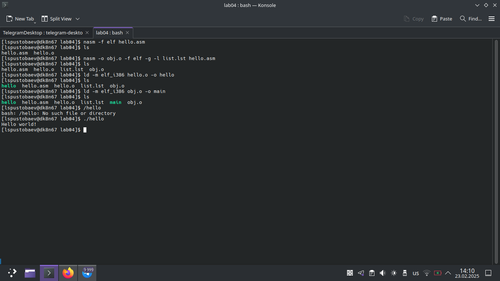
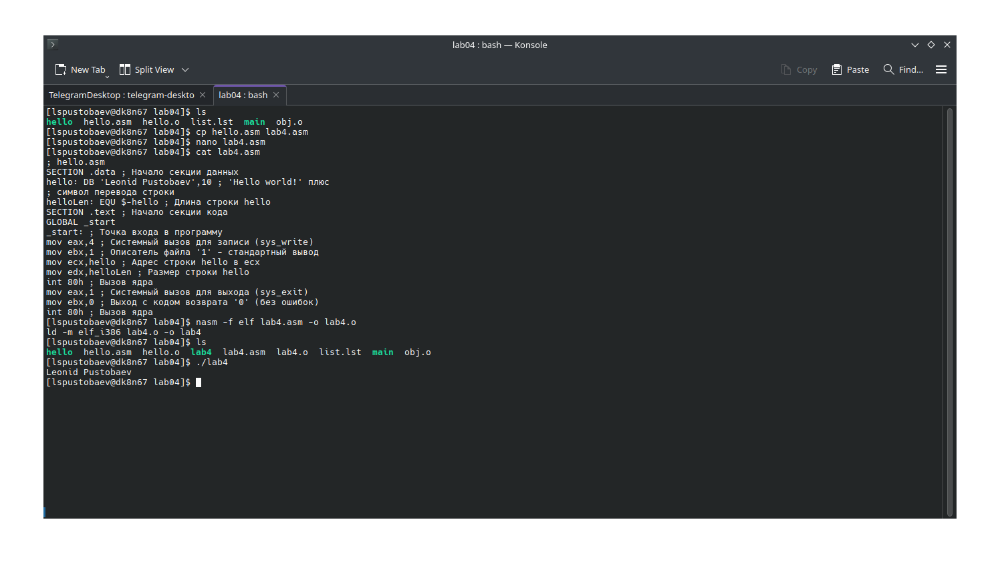

# Титульный лист

**Номер лабораторной работы:** 4  
**ФИО студента:** Пустобаев Леонид Сергеевич
**Группа:** НММбд03-2024

---

# Цель работы

Целью данной лабораторной работы является Освоение процедуры компиляции и сборки программ, написанных на ассемблере NASM.

---

 

На первом скриншоте я демонстрирую создание команды hello world и её превращение в исполняемый файл, после выполнения процедуры, проверяю работу программы, демонстрирую содержимое файла с кодом, содержимое файлов можно помотреть в репозитории git.

# Результаты выполнения заданий для самостоятельной работы

 

На втором скриншоте я продемонстрировал выполение саиостоятельной работы, создание файла с кодом, создание исполняемого файла и его проверку, содержимое всех файлов можно посмотреть в git

---

# Выводы

Цель лабораторной работы достигнута. Я освоил процедуры компиляции и сборки программ, написанных на ассемблере NASM.
