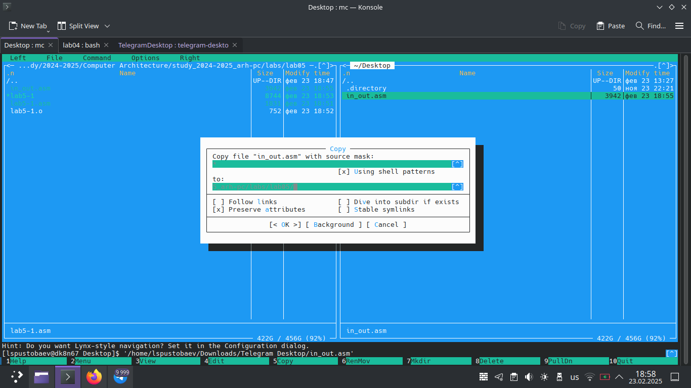

# Титульный лист

**Номер лабораторной работы:** 5 
**ФИО студента:** Пустобаев Леонид Сергеевич
**Группа:** НММбд03-2024

---

# Цель работы

Целью данной лабораторной работы является приобретение практических навыков работы в Midnight Commander. Освоение инструкций языка ассемблера mov и int.

---

 

На первом скриншоте я демонстрирую экран, который высветился у меня на мониторе после введения команды mc.

 

На втором скриншоте я демонстрирую выделение файла с помощью стрелочек и введение команды для редактуры этого файла.

 

На третьем скриншоте я демонстрирую содержимое файла, открытое через интерфес midnight commander.

 

На четвёртом скриншоте я демонстрирую сборку исполняемого файла и проверяю работу программы.

 

На пятом скриншоте я демонстрирую процесс копирования файла через midnight commander.

 

На шестом скриншоте я демонстрирую перемещение файла через midnight commander.

 

На седьмом скриншоте я демонстрирую созданный файл lab5-2.asm.

 

На восьмом скриншоте я демонстрирую содержимое файла с кодом, сборку исполняемого файла и проверку работы программы.

 

На девятом скриншоте я демонстрирую работу исправленной программы, подмечаю изменение строки вывода текста, теперь программа не начинает вывод текста с новой строки, а продолжает с текущей.

# Результаты выполнения заданий для самостоятельной работы

 

На последнем скриншоте я демонстрирую выполнение самосторятельной работы, копирую файлы с кодом, меняю его название, изменяю код, создаю исполнительные файлы и проверяю работу программы, содержимое файлов можно посмотреть в git

---

# Выводы

Цель лабораторной работы достигнута. Я приобрёл практические навыки работы в Midnight Commander и Освоенил инструкции языка ассемблера mov и int.
