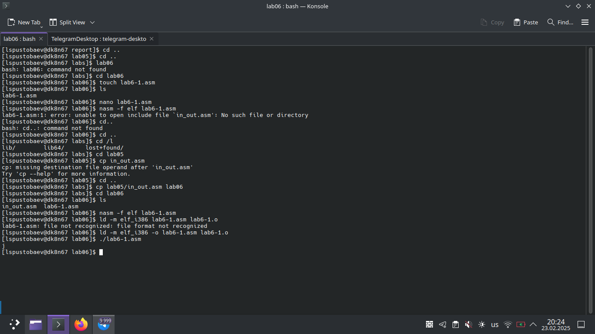
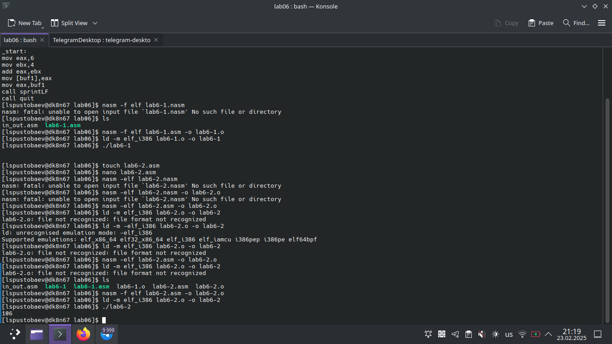
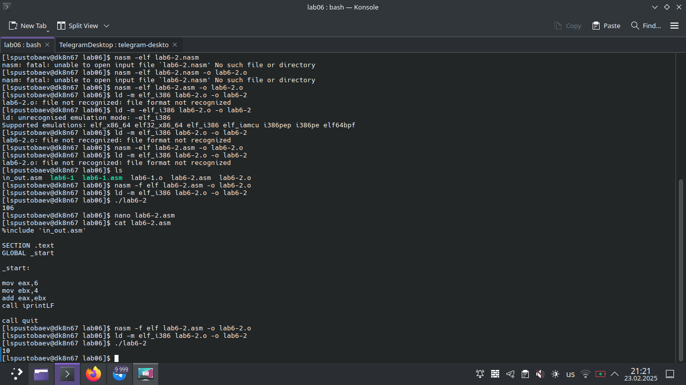
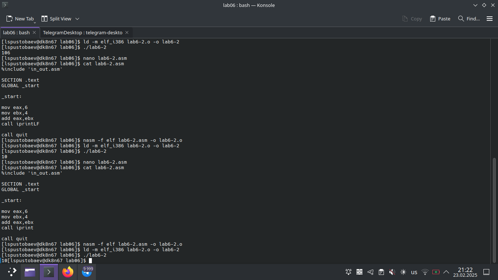
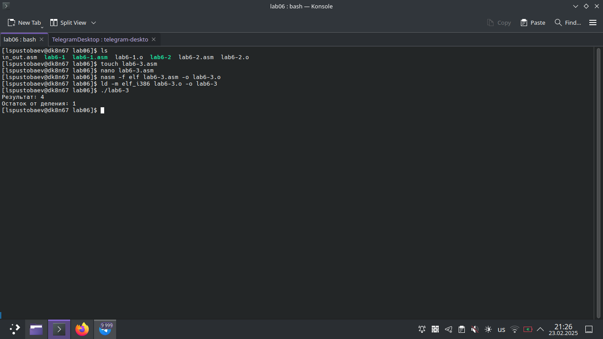
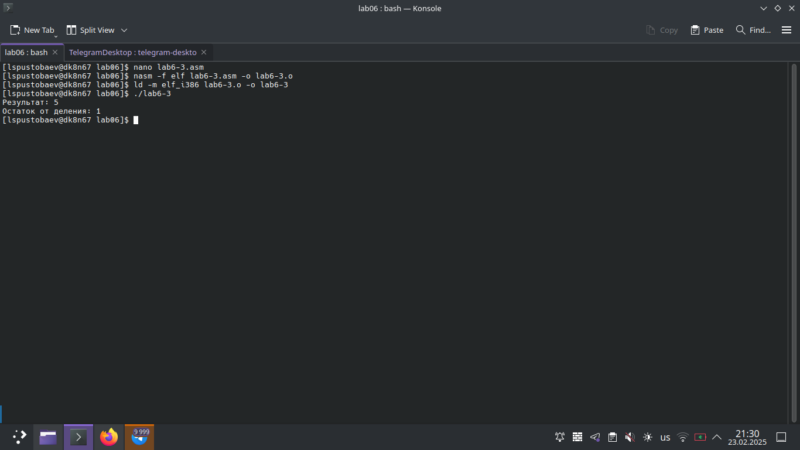
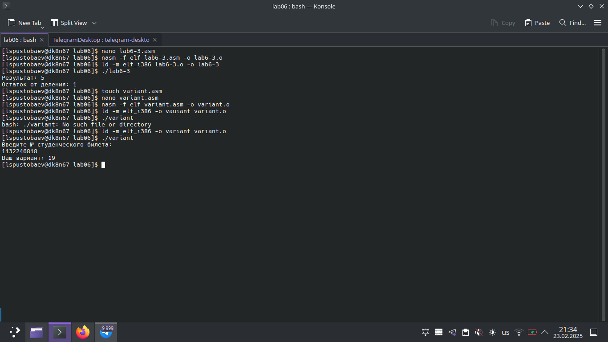
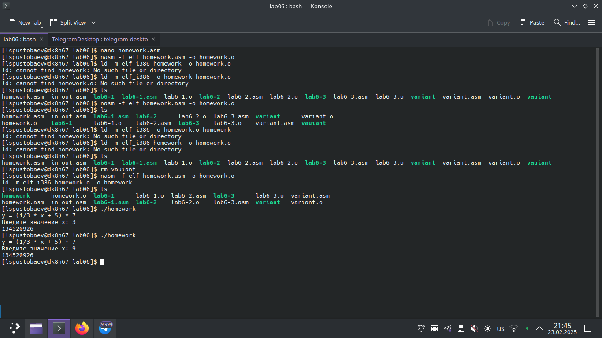

# Титульный лист

**Номер лабораторной работы:** 6  
**ФИО студента:** Пустобаев Леонид Сергеевич
**Группа:** НММбд03-2024

---

# Цель работы

Целью данной лабораторной работы является Освоение арифметических инструкций языка ассемблера NASM.

---

 

На первом скриншоте я демонстрирую процесс создания соответствующей папки, несколько попыток создать исполняемый файл по памяти, не понимание того, как  скопировать файл in_out.asm из одной папки в другую, проверку работы первой программы.

 

На втором скриншоте я демонстрирую работу изменённой по инструкции программы, несколько неудачных попыток вспомнить как создавать исполняемый файл, проверку работы изменённой программы .

 

На третьем скриншоте я демонстрирую работу второй программы с изначальным и изменённым синтаксисом. Как можно заметить, от типа переменной меняется и значения выражения

 

На четвёртом скриншоте я демонстрирую исполнение той же программы, но с выводом в ту же строчку, без перехода строки.

 

На пятом скриншоте я демонстрирую создание и исполнение третьей программы.

 

На шестом скриншоте я демонстрирую исполнение той же программы, но с изменёнными значениями аргументов.

 

На седьмом скриншоте я демонстрирую исполнение программы по определению варианта с входными данными в виде студенческого билета, посмотреть содержимое программы можно в git.

# Результаты выполнения заданий для самостоятельной работы

 

На восьмом скриншоте я продемонстрировал выполение самостоятельной работы, создание файла с кодом, создание исполняемого файла и его проверку, содержимое всех файлов можно посмотреть в git

---

# Выводы

Цель лабораторной работы достигнута. При выполнении данной лабораторной работы я освоил арифметические инструкции языка ассемблера NASM.
