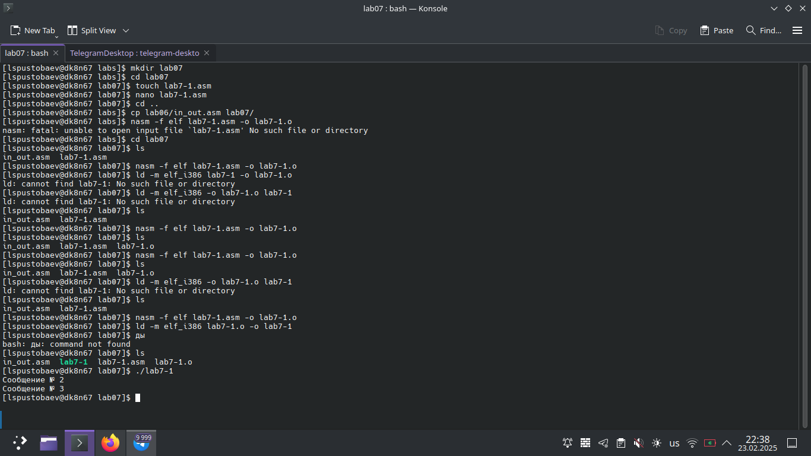
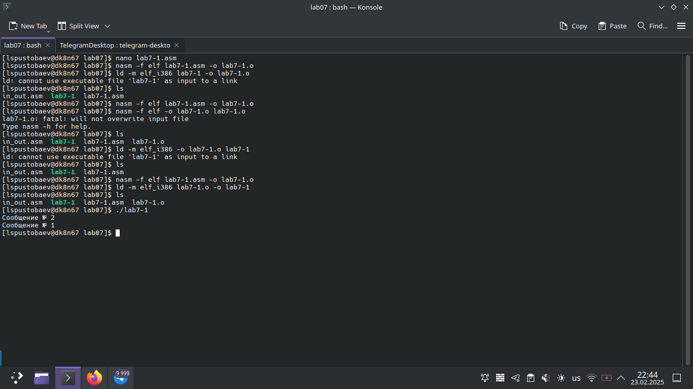
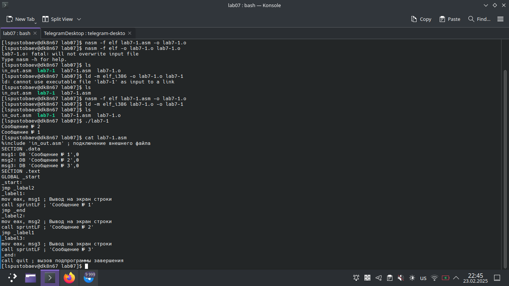
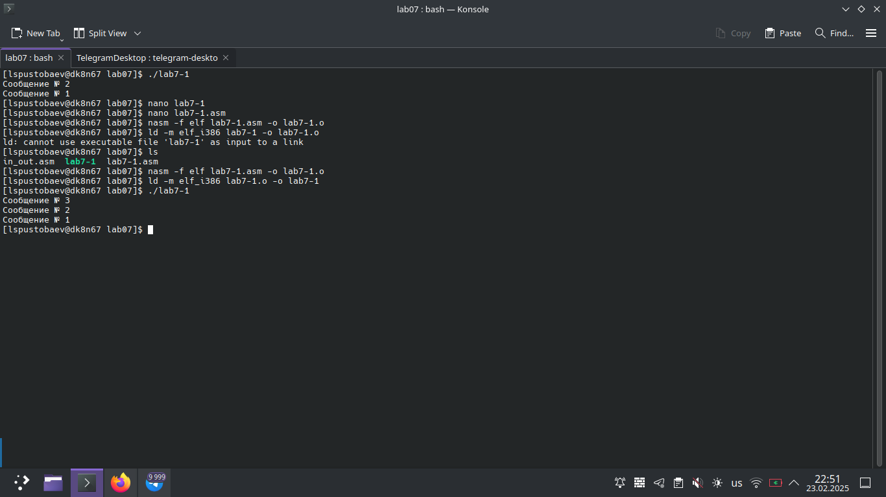
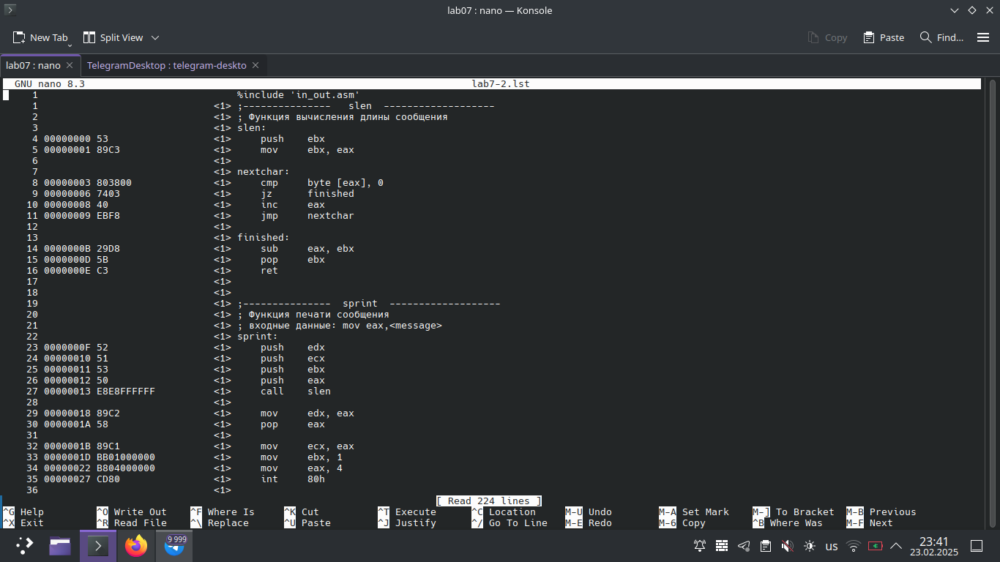
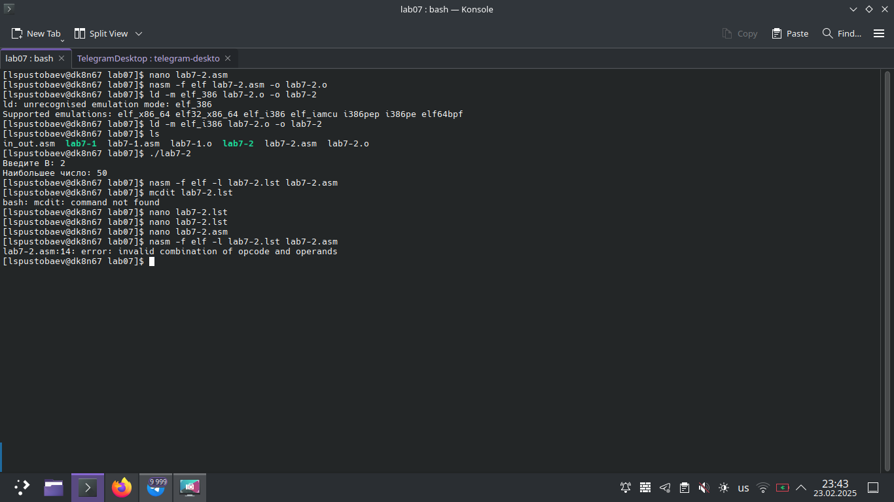
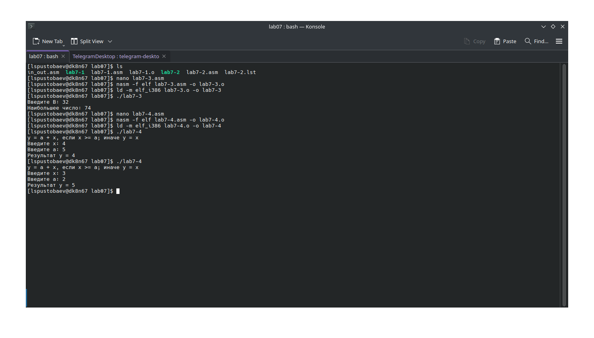
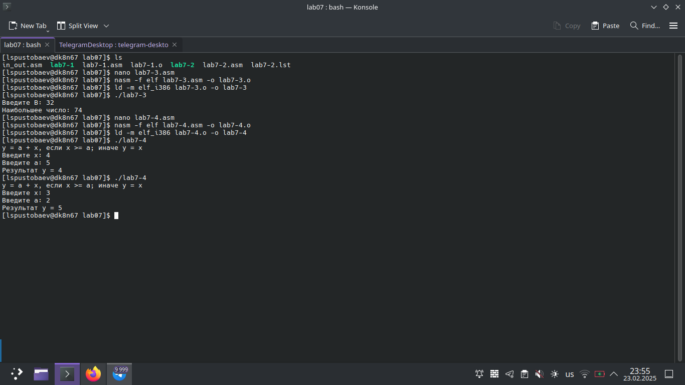

# Титульный лист

**Номер лабораторной работы:** 7  
**ФИО студента:** Пустобаев Леонид Сергеевич
**Группа:** НММбд03-2024

---

# Цель работы

Целью данной лабораторной работы является Изучение команд условного и безусловного переходов. Приобретение навыков написания программ с использованием переходов. Знакомство с назначением и структурой файла листинга.

---

 

На первом скриншоте я демонстрирую процесс создания соответствующей папки, несколько попыток создать исполняемый файл по памяти проверку работы первой программы.

 

На втором скриншоте я демонстрирую работу изменённой по инструкции программы, несколько неудачных попыток вспомнить как создавать исполняемый файл, проверку работы изменённой программы .

 

На третьем скриншоте я демонстрирую код второй программы.

 

На четвёртом скриншоте я демонстрирую исполнение той же программы, затем исправленной программы, содержание всех файлов можно найти в git.

 

На пятом скриншоте я демонстрирую содержание файла листинга.

 

На шестом скриншоте я демонстрирую написание второй программы, её проверку, и просмотр файла листинга, последующий пункт инструкции не сработал на моём компьютере, поэтому демонтсрирую ошибку, которую получил в ходе работы.

# Результаты выполнения заданий для самостоятельной работы

 

На седьмом скриншоте я демонстрирую выполение задания самостоятельной работы. Создаю программу и проверяю её работу, исходный файл можно посмотреть в git.

 

На восьмом скриншоте я демонстрирую выполение второго заднаия самостоятельной работы, Создаю вторую программу и проверяю её работу, исходный файл можно посмотреть в git

---

# Выводы

Цель лабораторной работы достигнута. При выполнении данной лабораторной работы я освоил команды условного и безусловного переходов, приобрёл навыков написания программ с использованием переходов и познакомствилмя с назначением и структурой файла листинга.
