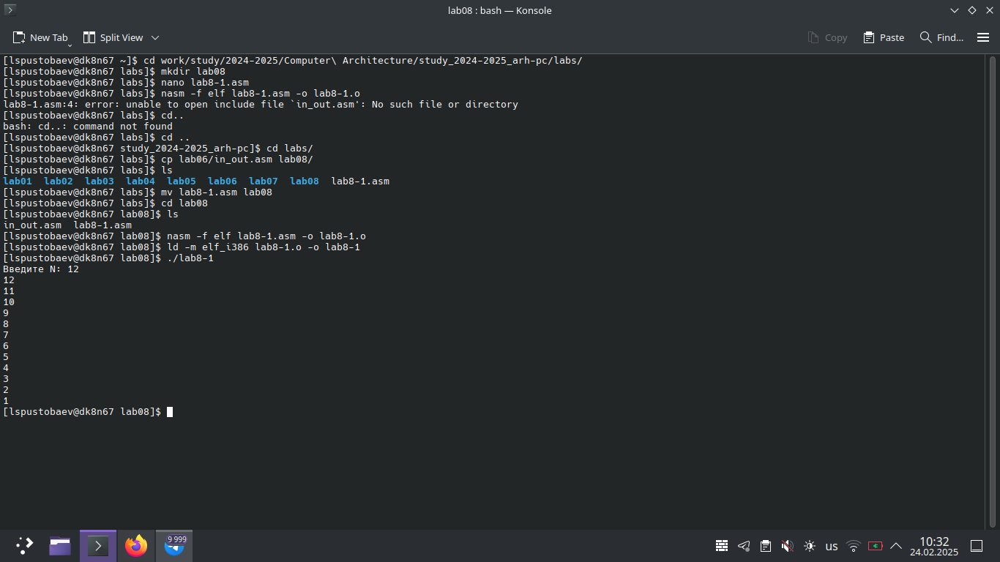
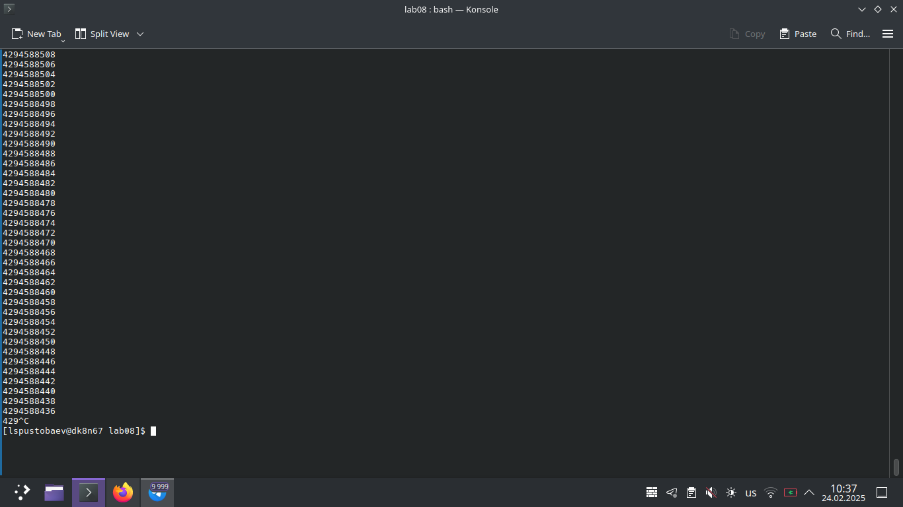
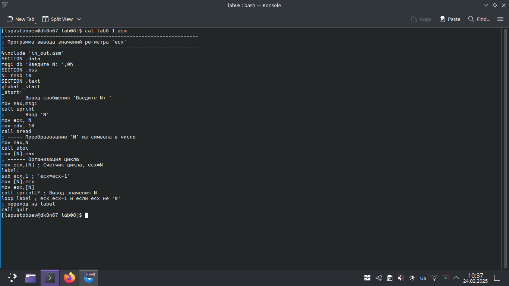
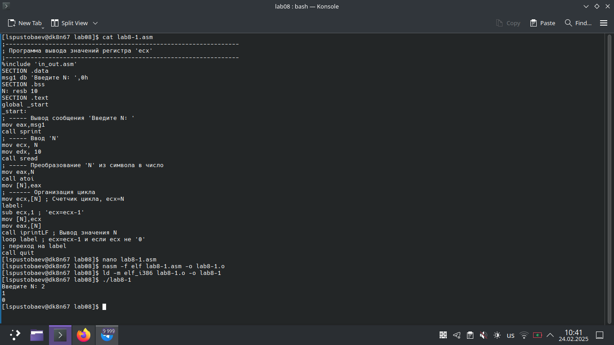
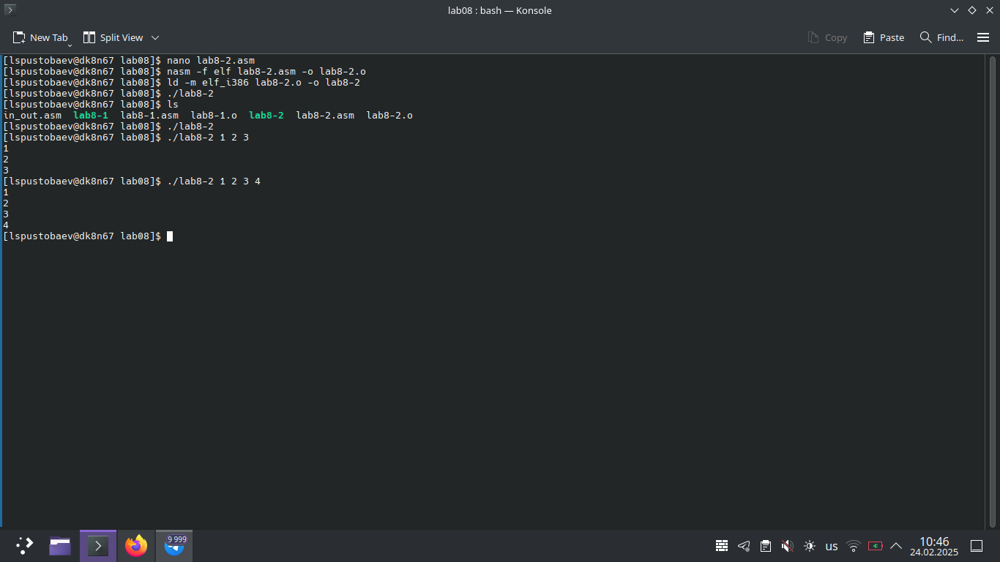
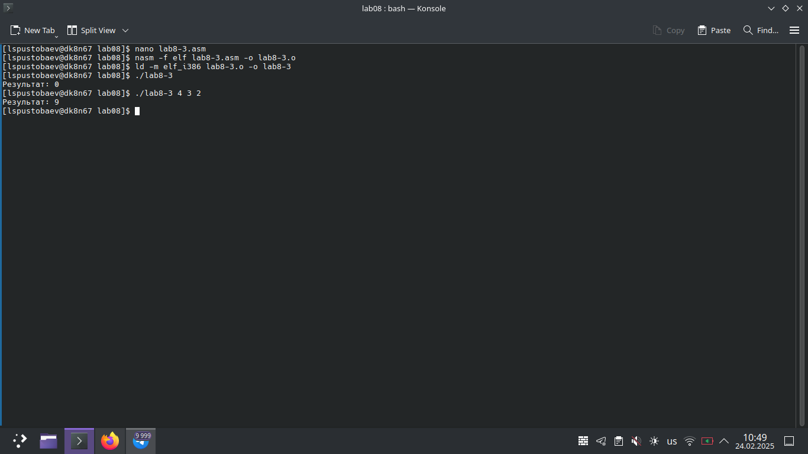
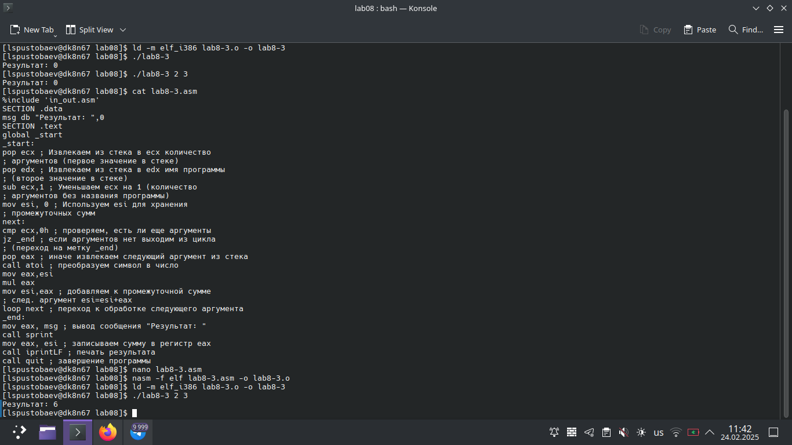
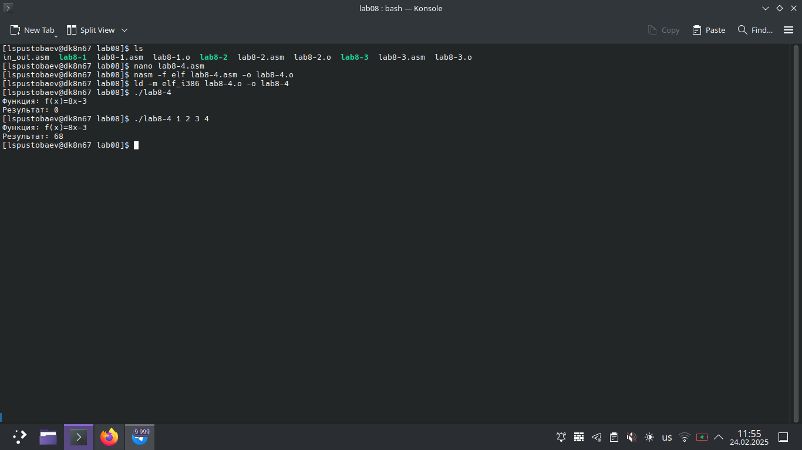

# Титульный лист

**Номер лабораторной работы:** 8
**ФИО студента:** Пустобаев Леонид Сергеевич
**Группа:** НММбд03-2024

---

# Цель работы

Целью данной лабораторной работы является приобретение навыков написания программ с использованием циклов и обработкой аргументов командной строки.

---

 

На первом скриншоте я демонстрирую создание программы и исполняемого файла, проверку работы программы, а также показываю, как тяжело мне даётся перемещение объектов между папками

 

На втором скриншоте я демонстрирую исправленный файл программы и созданный новый исполняемый файл, результат работы прогаммы после исправления

 

На третьем скриншоте я демонстрирую код программы 

 

На четвёртом скриншоте я демонстрирую работу программы после второго исправления

 

На пятом скриншоте я демонстрирую работу второй программы

 

На шестом скриншоте я демонстрирую работу третьей программы

 

На седьмом скриншоте я демонстрирую код программы до исправления и результат её работы после исправления

# Результаты выполнения заданий для самостоятельной работы

 

На восьмом скриншоте я продемонстрировал выполение саиостоятельной работы, создание файла с кодом, создание исполняемого файла и его проверку, содержимое всех файлов можно посмотреть в git

---

# Выводы

Цель лабораторной работы достигнута. Я приобрёл навыки написания программ с использованием циклов и обработки аргументов командной строки.
