# Титульный лист

**Номер лабораторной работы:** 9 
**ФИО студента:** Пустобаев Леонид Сергеевич
**Группа:** НММбд03-2024

---

# Цель работы

Целью данной лабораторной работы является Приобретение навыков написания программ с использованием подпрограмм. Знакомство с методами отладки при помощи GDB и его основными возможностями.

---

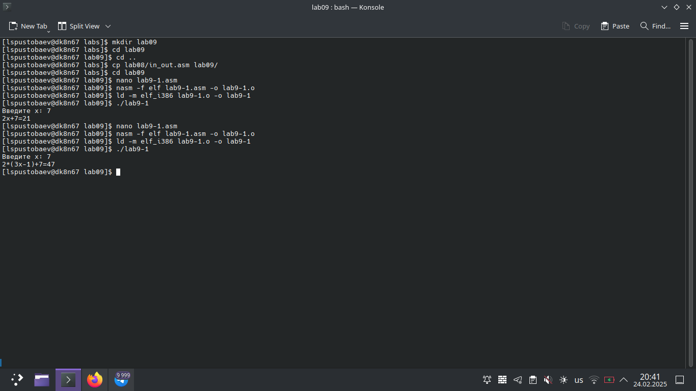
 

На первом скриншоте я демонстрирую создание программы и её проверку.

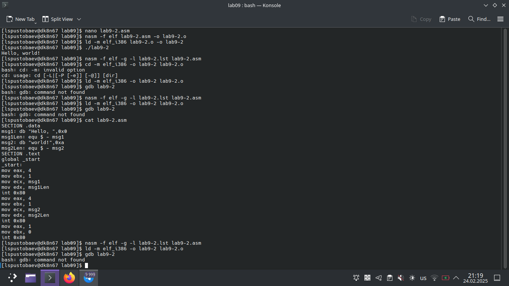
 

На втором скриншоте я демонстрирую создание второй программы, её проверку, а также осазнаие того, что у меня нет gdb и его придётся скачать.

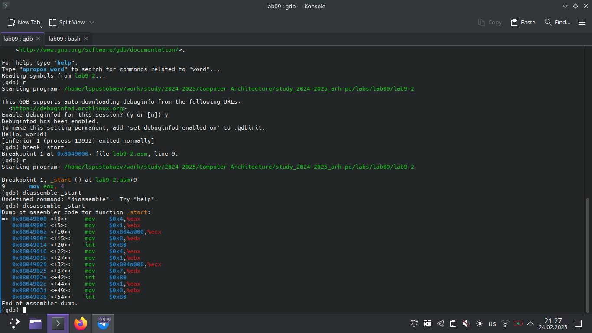
 

На третьем скриншоте я демонстрирую заработваший gdb, я показываю как я устанавливаю breakpoint и запускаю отладчик. Также я показываю как не с первой попытки написал disassemble и работу этой инструкции

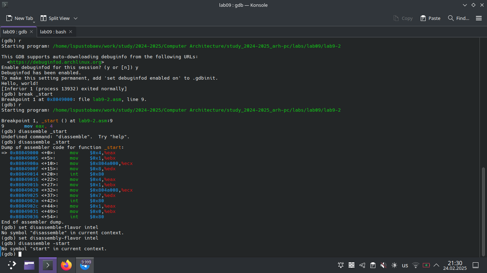
 

На четвёртом скриншоте я демонстрирую ошибку, которая у меня возникла при выполнении лабораторной работы, мне не удалось её исправить.

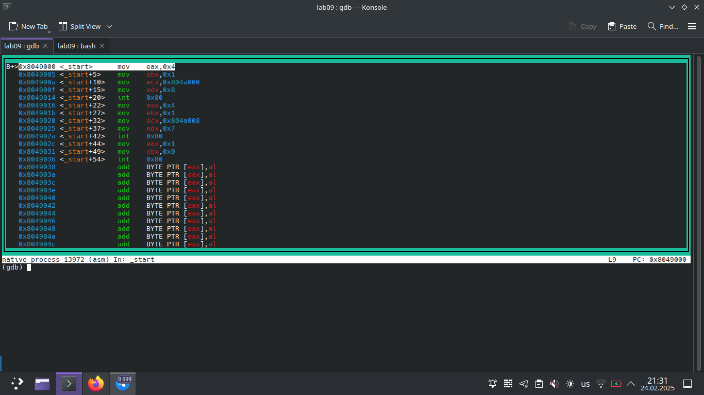
 

На пятом скриншоте я демонстрирую как меняется экран при вводе инструкции layout asm

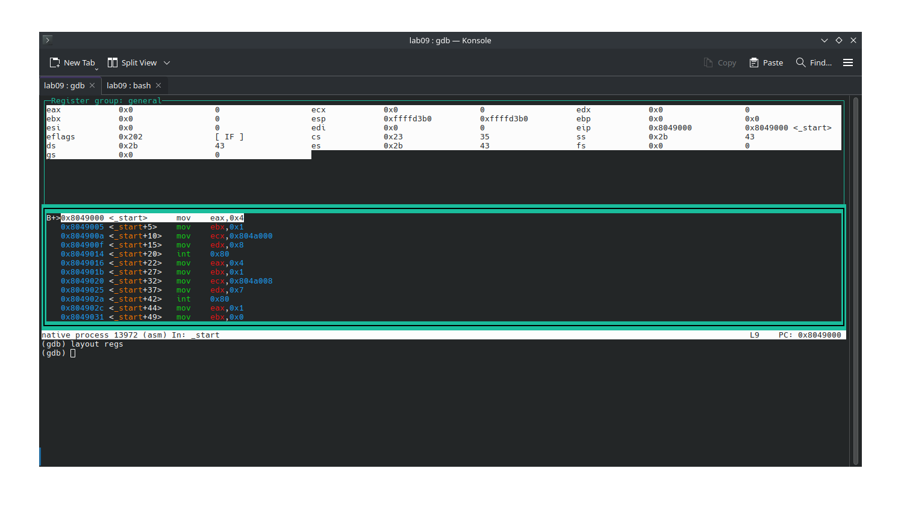
 

На шестом скриншоте я демонстрирую финальную версию окна gdb ещё и с окном регистров

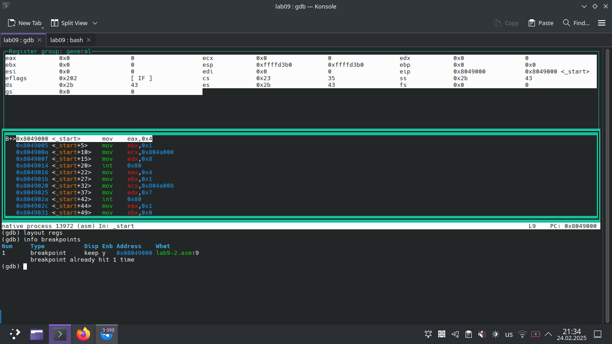
 

На седьмом скриншоте я демонстрирую инструкцию info breackpoints 

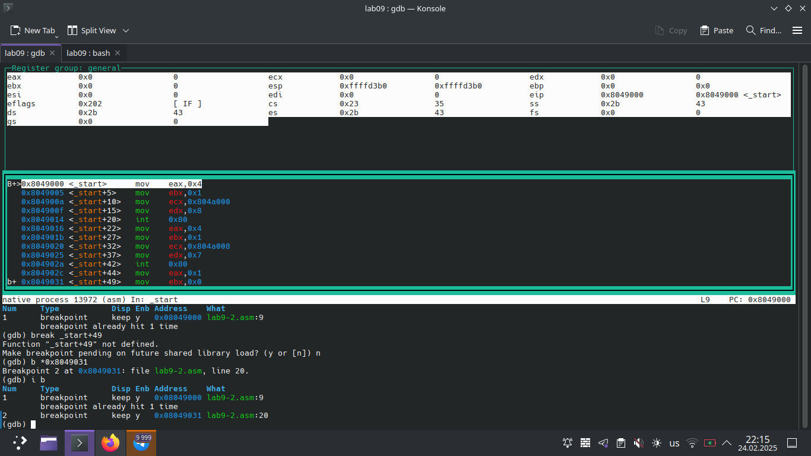
 

На восьмом скриншоте я демонстрирую инструкцию i b

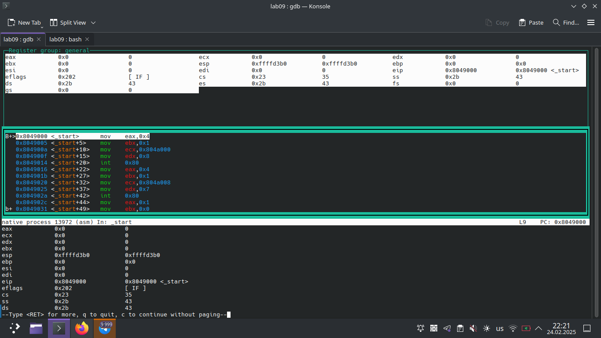
 

На девятом скриншоте я демонстрирую исполнение работы следующей инструкции

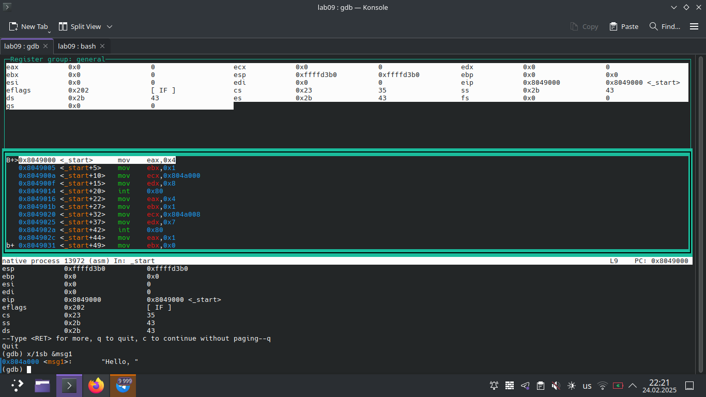
 

На десятом скриншоте я демонстрирую содержимое msg1

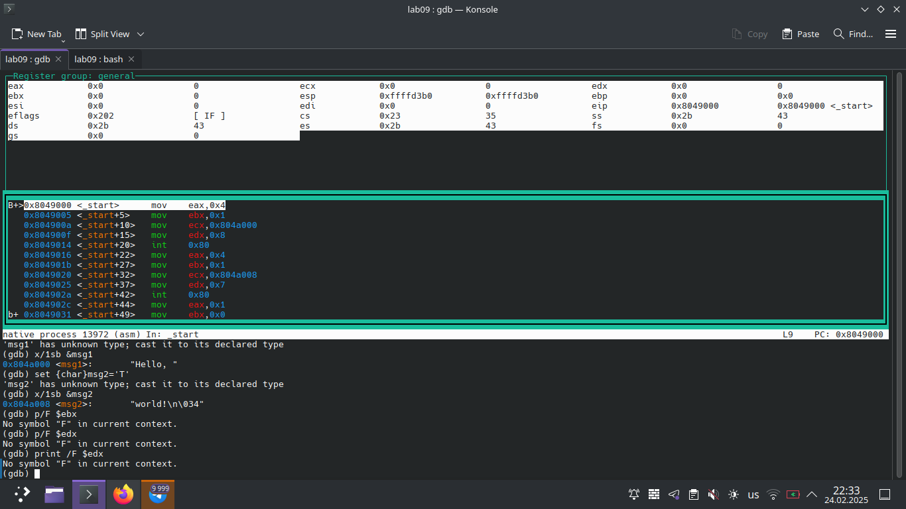
 

На одинадцатом скриншоте я демонстрирую содержимое msg2 и невозможность исполнение инструкции p/F, ошибка не была устранена

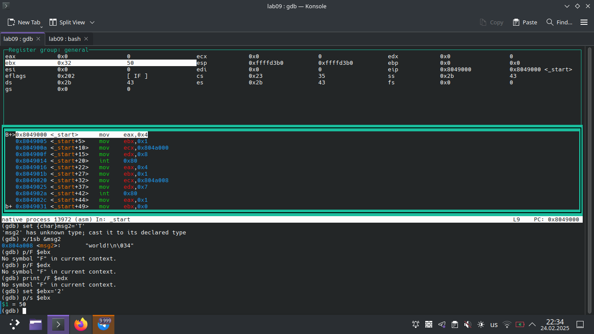
 

На двенадцатом скриншоте я демонстрирую установку значения в $ebx и вывод её на экран, инструкция print работет исправно

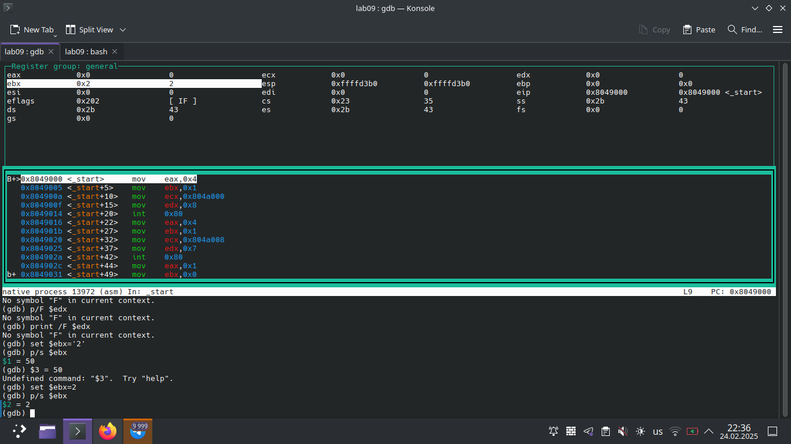
 

На тринадцатом скриншоте я демонстрирую установку заначения для $ebx в виде числа, а не символа

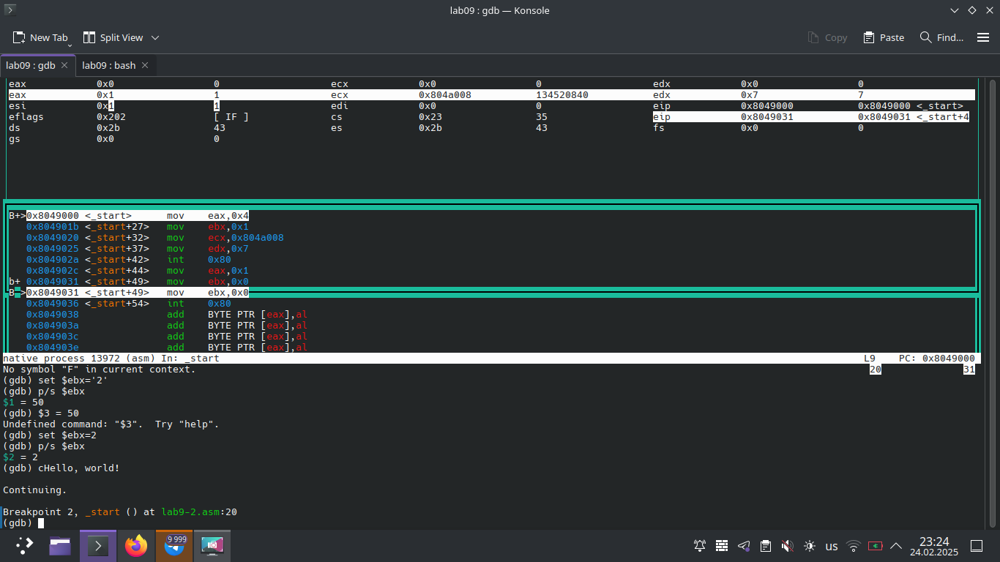
 

На четырнадцатом скриншоте я демонстрирую продожение работы программы после инструкции continue

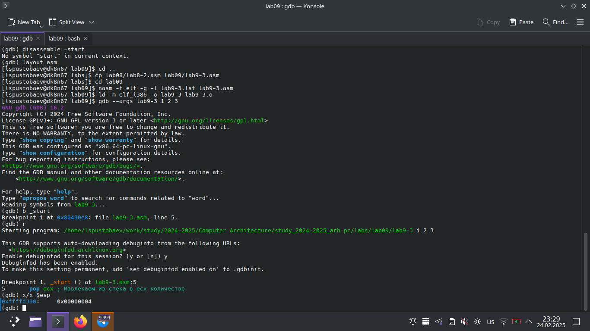
 

На пятнадцатом скриншоте я демонстрирую второй запуск gdb, на этот раз с другой программой. Исследую стек программы, обнаруживаю, что в стеке всего 4 элемента, а не 5

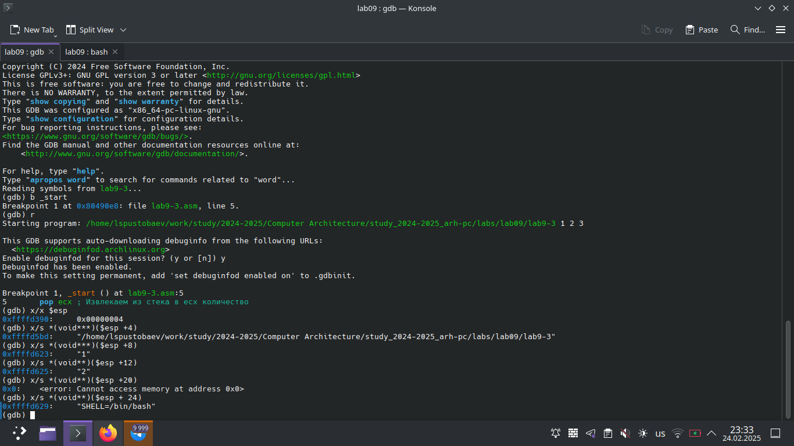
 

На шестнадцатом скриншоте я демонстрирую содержимое каждой из переменных записанных в стеке. Подмечаю, что шаг равен 4 битам, именно такой размер у ячейки стека. По не понятной мне причине в стеке всего два элеиента, а не три

# Результаты выполнения заданий для самостоятельной работы
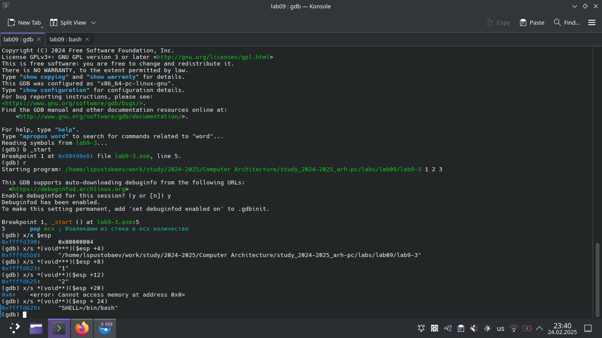
 

На семнадцатом скриншоте я продемонстрировал выполение самостоятельной работы, создание файла с кодом, создание исполняемого файла и его проверку, содержимое всех файлов можно посмотреть в git

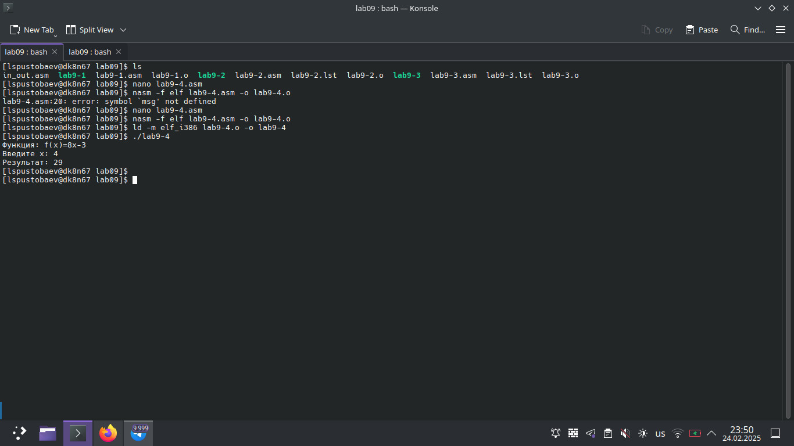
 

На втором скриншоте я продемонстрировал выполение самостоятельной работы, создание файла с кодом, создание исполняемого файла и его проверку, содержимое всех файлов можно посмотреть в git

---

# Выводы

Цель лабораторной работы достигнута. Я приобрел навыки написания программ с использованием подпрограмм, а также познакомился с методами отладки при помощи GDB и его основными возможностями.
