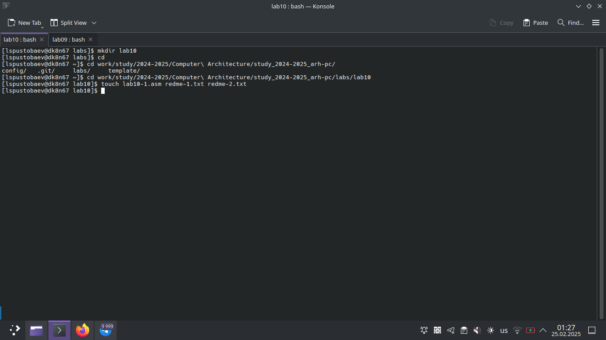
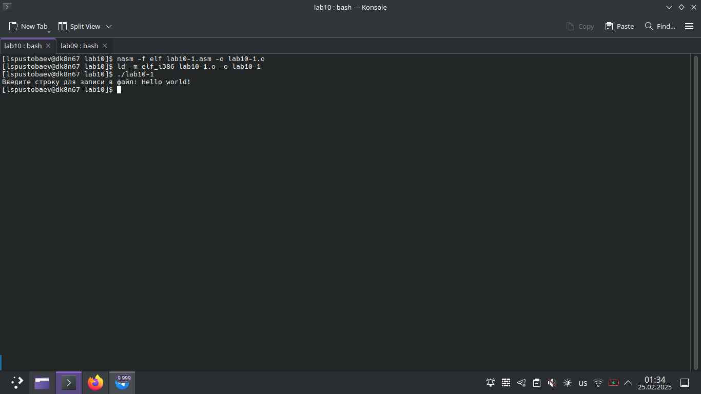
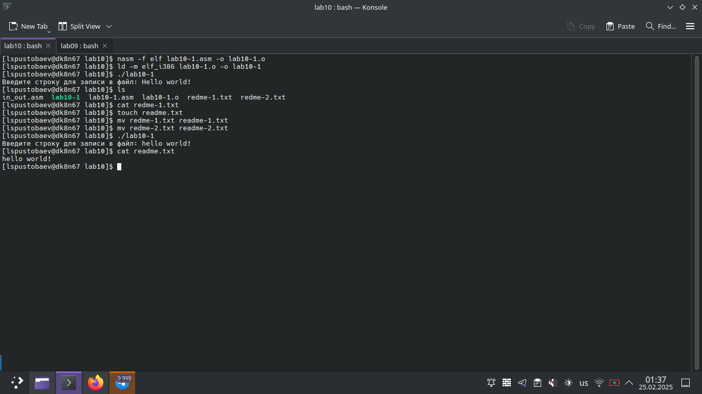
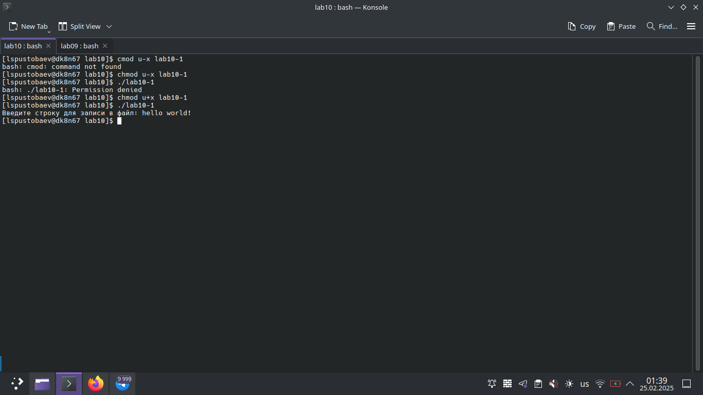
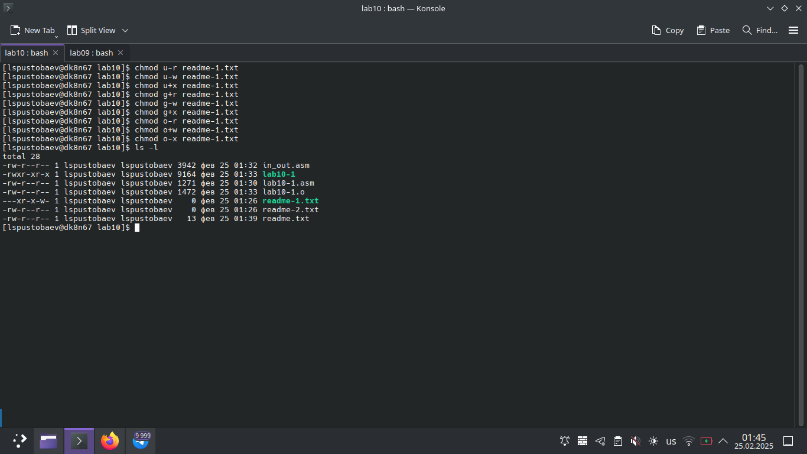
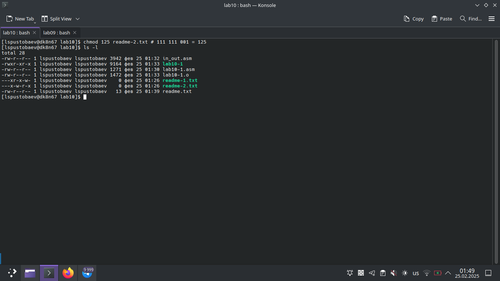
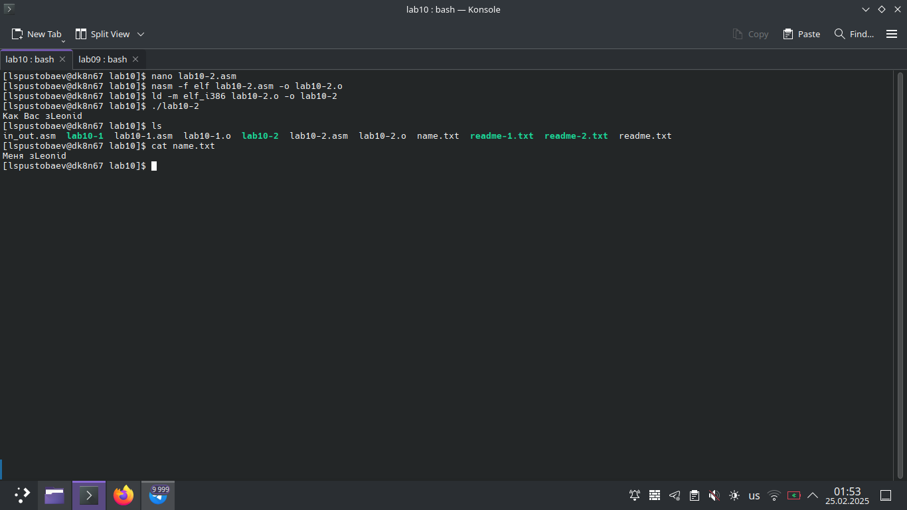

# Титульный лист

**Номер лабораторной работы:** 10
**ФИО студента:** Пустобаев Леонид Сергеевич
**Группа:** НММбд03-2024

---

# Цель работы

Целью данной лабораторной работы является приобретение навыков написания программ для работы с файлами.

---

 

На первом скриншоте я демонстрирую как создаю папку для хранения лабораторной работы и файлы с не правильным неймингом,

 

На втором скриншоте я демонстрирую работу программы 

 

На третьем скриншоте я меняю нейминг текстовым файлам и проверяю работу программы через инструкцию cat

 

На четвёртом скриншоте я демонстрирую работу инструкции chmod проверяю доступ к файлу

 

На пятом скриншоте я демонстрирую работу всех флагов доступа для интсрукции chmod

 

На шестом скриншоте я демонстрирую работу chmod при двоичной кодировке

# Результаты выполнения заданий для самостоятельной работы

 

На седьмом скриншоте я продемонстрировал выполение саиостоятельной работы, создание файла с кодом, создание исполняемого файла и его проверку, текстовое сообщение выводится не плностью, но функционал соответствует заданию. содержимое всех файлов можно посмотреть в git

---

# Выводы

Цель лабораторной работы достигнута. Я приобрел навыки написания программ для работы с файлами.
